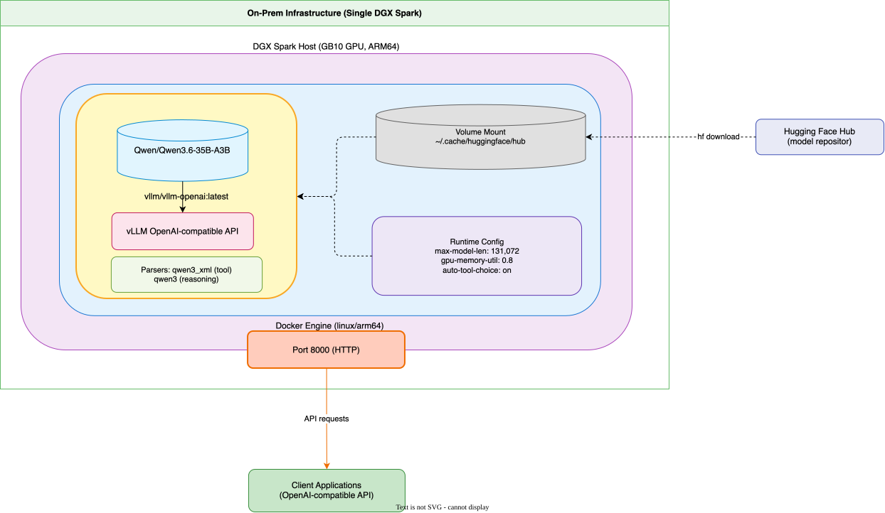

# llm-server

Serve a local LLM from a single on-prem NVIDIA DGX Spark, exposing an OpenAI-compatible API to client applications.

## Architecture



The model runs in a `vllm/vllm-openai:latest` container (linux/arm64) on the DGX Spark host's GB10 GPU. The container mounts the Hugging Face cache for the model weights and is reached by clients over HTTP on port 8000.

Diagram source: [assets/on-prem-llm-server.drawio](assets/on-prem-llm-server.drawio)

## Quick start

```sh
./nvidia-dgx-spark/vllm-server
```

The script downloads the model, pulls the vLLM image, and starts the server (default model `Qwen/Qwen3.6-35B-A3B`, context length 131,072).

## Contents

- [nvidia-dgx-spark/vllm-server](nvidia-dgx-spark/vllm-server) — start/stop script for the vLLM server
- [nvidia-dgx-spark/sparkrun-models.md](nvidia-dgx-spark/sparkrun-models.md) — models supported by `sparkrun` with ≥ 8B active parameters
- [assets/](assets/) — architecture diagram (drawio source and rendered SVG)
